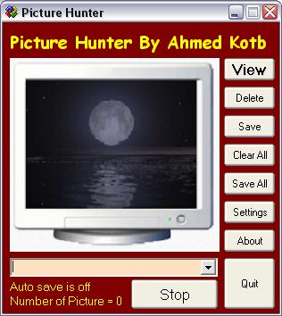



## Picture Hunter

### Description

Each time I want to capture the screen with the print screen button I had to go to mspaint and paste the picture and then save it, but these steps are boring especially when you are taking more than one picture from a full screen program or a game. With this program u only have to run it and it will start monitoring the clipboard , it also have an Auto Save option to automatically save pictures to a certain folder (previously determined ) after u click print screen button.

Important note : at the beginning I had made this program for me and not to upload it to psc so I used a control that I have downloaded from psc which is the champleon button just to make the program more beautiful but after a while I decided to upload it because it might be useful and I was going to remove the control from it but it was going to take a lot of time so I uploaded it with the control and if the author of the control have any objection please tell me.

Finally , I hope that you find my program useful.
 
### More Info
 

             |
---                |---
**Submitted On**   |2004-08-13 21:30:50
**By**             |[Ahmed Kotb](https://github.com/Planet-Source-Code/PSCIndex/blob/master/ByAuthor/ahmed-kotb.md)
**Level**          |Beginner
**User Rating**    |5.0 (10 globes from 2 users)
**Compatibility**  |VB 6\.0
**Category**       |[Complete Applications](https://github.com/Planet-Source-Code/PSCIndex/blob/master/ByCategory/complete-applications__1-27.md)
**World**          |[Visual Basic](https://github.com/Planet-Source-Code/PSCIndex/blob/master/ByWorld/visual-basic.md)
**Archive File**   |[Picture\_Hu1903476192005\.zip](https://github.com/Planet-Source-Code/ahmed-kotb-picture-hunter__1-61239/archive/master.zip)

